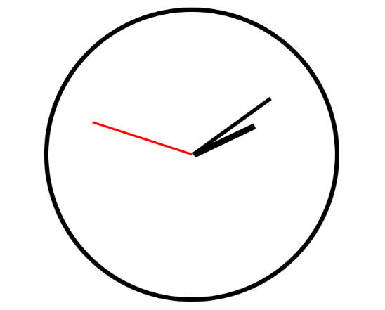
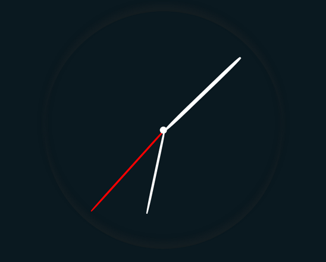

# Reloj Analógico Web

## Descripción

Este ejercicio presenta un reloj analógico simple diseñado para visualizar la hora actual en una interfaz web. Utiliza HTML para la estructura, CSS para el diseño visual y JavaScript para la funcionalidad del reloj. El reloj muestra las manecillas de las horas, minutos y segundos en un formato visual clásico.

## Vista del Modelo

Aquí puedes ver la imagen del modelo que se utilizó como referencia:

## Vista Codificada

A continuación, se muestra la imagen del resultado obtenido:

## Autor

Este ejercicio fue realizado por **Valeria Torrealba**.